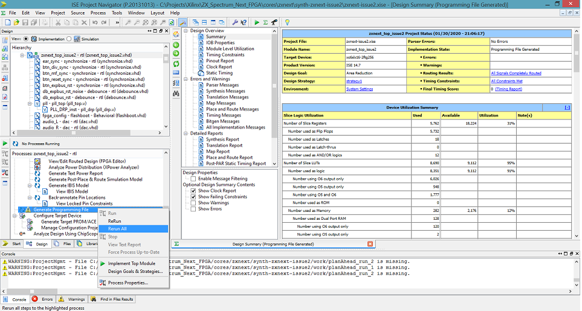

# ZX Spectrum Next

Xilinx ISE 14.7 is required to build the zx spectrum next core.

A 16MB flash chip connected to the fpga is used to store core bitstreams.  The chip is divided into 32 slots of 512KB each, each of which can store a bitstream.  The first two slots, slot 0 and slot 1, are reserved for the zx next.  Slot 0 contains the anti-brick core, a core intended not to be changed as it is used to rescue the machine if something goes wrong.  Slot 1 contains the zx next core.

The fpga will configure itself using the anti-brick core in slot 0 at power up.  Shortly after, the fpga will reconfigure using the zx next core in slot 1 and the spectrum next will boot per normal after customizing itself using information stored in the file **machines/next/config.ini** on the sd card.

The vhdl source code can be found rooted in **src/**
* **zxnext_pins_issue2.ucf** defines the external pinout of the fpga and the build constraints.
* **zxnext_top_issue2.vhd** contains connections to the external pins and takes care of housekeeping not related to the zx next machine itself.
* **zxnext.vhd** is the implementation of the zx spectrum next. The source code for instantiated modules can be found in surrounding subdirectories.

## BUILDING TBBLUE.TBU

TBBLUE.TBU is a file that contains a header and a zx next core bitstream.  The bitstream stored in this file is copied to slot 1 in the flash chip.  The header contains a crc check and a core version number.

To generate TBBLUE.TBU, first build the zx next core.

1. If you have made changes to the vhdl, make sure the core version number is set correctly at the top of **src/zxnext_top_issue2.vhd** at about line 50.
2. Navigate to **synth-zxnext-issue2/**
3. Double click on **zxnext-issue2.xise** to have ISE automatically load the project.  If this file type is not associated with ISE on your machine, start ISE as you normally would and load this project file from the menu.
4. Right click on "Generate Programming File" as shown in the diagram below and choose "Re-Run All".  You may have to choose the "Implementation View" in the top left and the "Design" tab on the bottom left to see the same panels as shown in the picture.

5. After some time, the build will complete with the bitstream generated into **synth-zxnext-issue2/work/zxnext_top_issue2.bit**
6. Navigate to **tbumaker/**
7. Open a command prompt in that directory.  (On windows this may be "FILE->Open Command Prompt")
8. Run "maketbu"
9. Where it asks for a version number, enter the core id as set in step 1 (eg 30100 = 3.01.00)
10. The file "TBBLUE.TBU" will be generated which can then be copied to the root directory on the sd card, replacing the TBBLUE.TBU file already present.

The TBBLUE.TBU file is only used when updating the machine.  The fpga configures itself using the bitstream stored in slot 1 of the flash.  The updater reads the TBBLUE.TBU file, verifies the crc is correct, and then writes it to slot 1.  So the final step to update your machine is to run the updater.

If you would like to perform an anti-brick update, follow the instructions listed in the manual.  An anti-brick update can be used if the zx next core is damaged or bugged such that the zx next core is not operating correctly.  If the zx next core is not operating correctly, then it is best to use the anti-brick core to perform the update to make sure the flash is not incorrectly written.  During an anti-brick update, the machine may only generate a VGA picture.

To perform a regular update using the zx next core, hold "U" while powering up or while doing a hard reset.  The updater screen will appear, let go of "U" and answer yes to perform the update.  You must not interrupt the update process; interrupting the update could damage the contents of slot 1 so that the machine cannot boot up.  Then an anti-brick update would have to be performed to fix slot 1.  When the update is finished, completely power down the machine by disconnecting the power supply and disconnecting hdmi if you are using that.  Wait about 10 seconds, plug in the hdmi and then power up the machine.  If all goes well, the update will be completed.

## BUILDING AN MCS FILE

An mcs file can be used to program the flash chip directly using a jtag interface and cable.  This method does not require the zx next to be on or even functioning.

The mcs file built will hold the contents of slot 0 (the anti-brick core) and slot 1 (the zx next core).

After successfully building the zx next core (see the last section), a file **synth-zxnext-issue2/work/zxnext_top_issue2.bit** is generated.

1. Copy **synth-zxnext-issue2/work/zxnext_top_issue2.bit** to **mcsmaker/**.  There should now be two bit files **next_ab_issue2_top.bit** and **zxnext_top_issue2.bit**.
2. Open a command prompt in **mcsmaker/**
3. Run "mcs_generator_issue2".
4. The mcs file "zxnext.mcs" will be produced.

## SPECIFICATIONS

The ZX Spectrum Next core is not completed yet but the aim is to finish for the second kickstarter.  Nevertheless the majority of the planned functionality is already implemented.

A brief summary of the current machine specifications:

* **CPU** : Z80N (z80 compatible with some additional instructions) operable at software selectable speeds of 3.5 MHz, 7 MHz, 14 MHz or 28 MHz with wait states.
* **COPPER** : A co-processor running independently of the cpu executes simple instructions that can modify the nextreg state.  For example, it can change palettes, alter the display mode or play stereo music.  The copper is synchronized with the display generation so it is able to make these changes at precise locations in the display.
* **DMA** : The ZXN DMA, compatible with a subset of the Z80 DMA chip, is able to perform transfers between memory and/or io using short two cycle reads and writes.  In burst mode, the zxn dma can send bytes at programmable rates allowing it to play sampled music while returning control to the cpu between transfers.  At this time the zxn dma and the cpu share the bus and the dma operates at the currently set cpu speed.
*  **RAM MEMORY** : 768K of RAM in the unexpanded machine or 1792K of RAM in the expanded machine.   This memory is available in 16K banks as in the original 128K Spectrums and can be mapped as usual using the standard ports 0x7ffd and 0x1ffd.   An additional port 0xdffd adds bits to port 0x7ffd to reach all memory banks.  The native bankswitching scheme in the zx next is called MMU.  This scheme divides the same memory into 8K pages and allows any page to be mapped into any 8K slot of the Z80's 64K address space.
*  **ROM MEMORY** : 64K of ROM is reserved for ROMs 0-3 as in the Spectrum +3.  Also available is 32K of Alt ROM that can replace the normal ROMs; this ROM is user programmable.
* **GRAPHICS** : The display is composed of layers with programmable priority.  Layers are listed below.
	* ULA : Compatible timing, contention and floating bus behaviour with the 48k, 128k, +3 and Pentagon.  Supports hardware pixel scrolling in the X and Y directions and these resolutions:
		* 256x192 pixel 32x24 attributes in bank 5 (48k / 128k)
		* 256x192 pixel 32x24 attributes in bank 7 (128k second display)
		* 256x192 pixel 32x24 attributes at 0x6000 in bank 5 (timex second display)
		* 256x192 pixel 32x192 attributes at 0x4000 and 0x6000 in bank 5 (timex hi-colour)
		* 512x192 pixel monochrome at 0x4000 and 0x6000 in bank 5 (timex hi-res)
	* LoRes : Occupies the same layer as the ULA with LoRes replacing the ULA where it is enabled.  Supports hardware pixel scrolling in the X and Y directions.  Two resolutions are available:
		* 128x96 4-bit colour per pixel at either 0x4000 or 0x6000 in bank 5 (Radastan mode originating on the ZX UNO)
		* 128x96 8-bit colour per pixel occupying 0x4000 and 0x6000 in bank 5
	* Layer 2 : A pixel mapped display without colour clash.  Supports hardware pixel scrolling in the X and Y directions.  Can be mapped to any location in memory starting at a 16K boundary.  Available resolutions are:
		* 256x192 8-bit colour per pixel
		* 320x256 8-bit colour per pixel
		* 640x256 4-bit colour per pixel
	* Sprites : Up to 128 hardware sprites of size 16x16 pixels with either 8-bits or 4-bits of colour per pixel.  A minimum of 100 sprites per line can be display at this size.  Sprites can be scaled 1x 2x 4x 8x, rotated, mirrored and linked together.
	* Tilemap : A hardware character display coming in two resolutions (80x32 = 640x256 pixels, 40x32 = 320x256).  Supports hardware pixel scrolling in the X and Y directions.  The character map and glyphs are stored at programmable locations in bank 5.  Individual characters can be independently rotated and mirrored.  Each glyph is 8x8 pixels in size with 4-bits of colour per pixel.  Another mode eliminates rotation and mirroring in favour of 8x8 pixel glyphs defined as monochrome UDGs but with more colour information stored in the character map.

	Some layer priority modes allow layer 2 to be highlighted or darkened by the ULA.  Another setting allows the tilemap and ULA to stencil each other.
* **SOUND** : Stereo sound is played through HDMI, 3.5mm audio jack or optional internal speaker.  Sound sources:
	* Beeper : Beeps and tape sound.
	* 3 x AY 8910 : Arranged to be compatible with the dual arrangement turbosound.  AY instances can be programmed as mono or either ABC or ACB stereo mode.
	* 4 x 8-bit DACs : Two DACs are assigned to the left channel and two are assigned to the right channel.  Common 8-bit dac peripherals in the spectrum community such as specdrum and soundrive are mapped to these dacs.
	* Raspberry PI I2S : Audio generated by an optional Pi accelerator can be mixed into the internal next audio stream or can be mapped to ear for tape loading.

